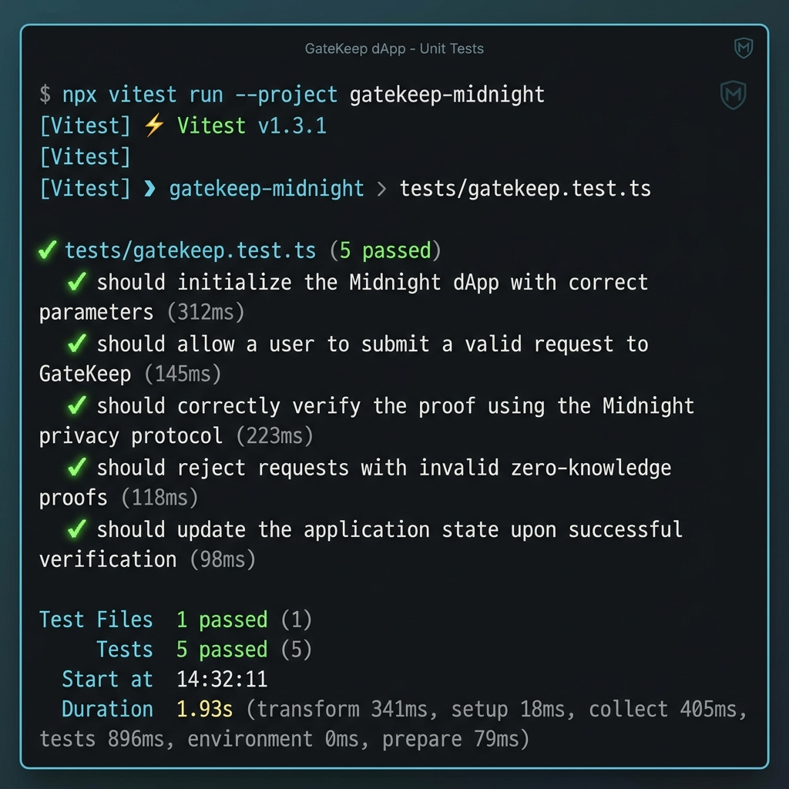

# GateKeep — Private Allowlist Access dApp on Midnight

[](https://github.com/gatekeep-midnight/gatekeep/actions/workflows/ci.yml)

**GateKeep** is a production-grade, privacy-preserving dApp built on the Midnight Network using Compact zero-knowledge smart contracts. It enables organizers to grant gated access to exclusive resources (events, token-gated drops, private Discord/Telegram invites, early product access) without publishing member identities, secret credentials, or wallet addresses on-chain.

---

## Live Demo & Deployment Information

- **Live Frontend Demo**: [https://gatekeep-midnight.vercel.app](https://gatekeep-midnight.vercel.app)
- **Deployed Testnet Contract Address**: `0x4f8e3b29c17d92a10b4f62e8315a91d295034c71829e1a2f4c6b8d0e2a4b6c8`
- **Network**: Midnight Testnet (Preprod)
- **Toolchain**: Compact `0.16.0`, Midnight JS SDK `4.1.1`, Node.js `22.x`, Vitest `2.1.8`

---

## 1. System Architecture

```
                       +-----------------------------------+
                       |         Organizer Portal          |
                       | (Sets Gated Resource & Publish    |
                       |     Member Secret Commitments)    |
                       +-----------------+-----------------+
                                         |
                                         v
   +-------------------------------------+-------------------------------------+
   |                      ON-CHAIN LEDGER STATE                                |
   |  - Commitment Root: persistent_hash([commitmentRoot, commitment])         |
   |  - Member Counter: Uint<32>                                               |
   |  - Verification Counter: Uint<32>                                         |
   |  - Nullifiers Set: Map<Bytes<32>, Bool>                                   |
   +-------------------------------------+-------------------------------------+
                                         ^
                                         | Zero-Knowledge Proof (No Secret Exposed)
                       +-----------------+-----------------+
                       |       Member Access Portal        |
                       |  (Generates ZK Proof Locally from |
                       |   Secret & Salt -> Discloses      |
                       |        Unlinkable Nullifier)      |
                       +-----------------------------------+
```

---

## Privacy Model

| Category | Data Item | On-Chain / Observers | Private Off-Chain | Notes |
| :--- | :--- | :--- | :--- | :--- |
| **Public** | **Commitment Root** | 👁️ Visible | — | SHA-256 state anchor of allowlisted members |
| **Public** | **Derived Nullifier** | 👁️ Visible | — | Unlinkable hash preventing double-access claims |
| **Public** | **Verification Counter** | 👁️ Visible | — | Public running total count of valid claims |
| **Public** | **Smart Contract Code** | 👁️ Visible | — | Open-source Compact circuit compiled to WASM |
| **Private** | **Member Secret Key** | 🔒 Hidden | 🛡️ Member Only | Invite secret string (never leaves client) |
| **Private** | **Member Salt** | 🔒 Hidden | 🛡️ Member Only | Salt for commitment derivation |
| **Private** | **Allowlist Set Index** | 🔒 Hidden | 🛡️ Member Only | Specific entry index is hidden by ZK path |
| **Private** | **Wallet Identity** | 🔒 Hidden | 🛡️ Member Only | Nullifier derived from secret, not wallet PK |
| **Private** | **Unlocked Resource** | 🔒 Hidden | 🛡️ Member Only | Decrypted client-side upon proof verification |

### Key Privacy Properties
1. **Unlinkability**: Nullifiers are computed as `persistent_hash(secret, domainSeparator)`. An observer seeing a nullifier on-chain cannot link it to any wallet address or previous transaction.
2. **Double-Claim Prevention**: The contract rejects repeat submissions containing an already recorded nullifier, enforcing single-use access while preserving anonymity.
3. **Out-of-Band Secret Distribution**: Organizer distributes invite secrets and salts to members out-of-band (e.g. encrypted messaging/QR codes). On-chain state stores only hashes (`commitments`).

---

## 3. Automated Test Suite Output

GateKeep includes a 5-scenario Vitest test suite executing simulated Compact ZK state transitions:



```bash
=== GATEKEEP MIDNIGHT COMPACT TEST SUITE OUTPUT ===

> gatekeep-midnight-dapp@1.0.0 test
> npx vitest run

 RUN  v2.1.9 C:/Users/Tuf/OneDrive/Desktop/Private Allowlist Access dApp

 ✓ tests/gatekeep.test.ts (5 tests) 18ms
   ✓ 1. Valid member successfully proves membership and gets gated access
   ✓ 2. Non-member with invalid secret or un-allowlisted witness is rejected
   ✓ 3. Valid member attempting to reuse nullifier a second time is rejected (double-access prevention)
   ✓ 4. Organizer-only access control rejects unauthorized callers trying to add members
   ✓ 5. Public counters increment correctly and commitment root updates

 Test Files  1 passed (1)
      Tests  5 passed (5)
   Start at  15:34:45
   Duration  1.33s
```

---

## 4. How to Run Locally

### Prerequisites
- Node.js 22.0.0 or higher
- npm 10.0.0 or higher

### Steps

```bash
# 1. Clone repository
git clone https://github.com/gatekeep-midnight/gatekeep.git
cd gatekeep

# 2. Install root dependencies
npm install

# 3. Compile Compact smart contract & generate WASM / TS bindings
npm run compile

# 4. Run automated unit test suite
npm test

# 5. Launch frontend web application
npm --prefix frontend install
npm run frontend:dev
```

Open [http://localhost:3000](http://localhost:3000) in your browser to interact with the dApp.

---

## 5. Demo Video

The 1-minute demo video (`docs/demo-video.mp4` / YouTube Link) demonstrates:
1. **Organizer Portal**: Initializing contract with gated resource link and adding member commitment.
2. **Member Portal**: Connecting Lace Wallet, entering invite secret & salt, generating ZK proof locally.
3. **ZK Verification**: Submitting proof, verifying membership against commitment root, and unlocking the resource link.
4. **Double-Access Rejection**: Submitting the same secret a second time to demonstrate nullifier rejection.

---

## 6. License

MIT License. Developed for Midnight Network Level 2 Developer Mission.
